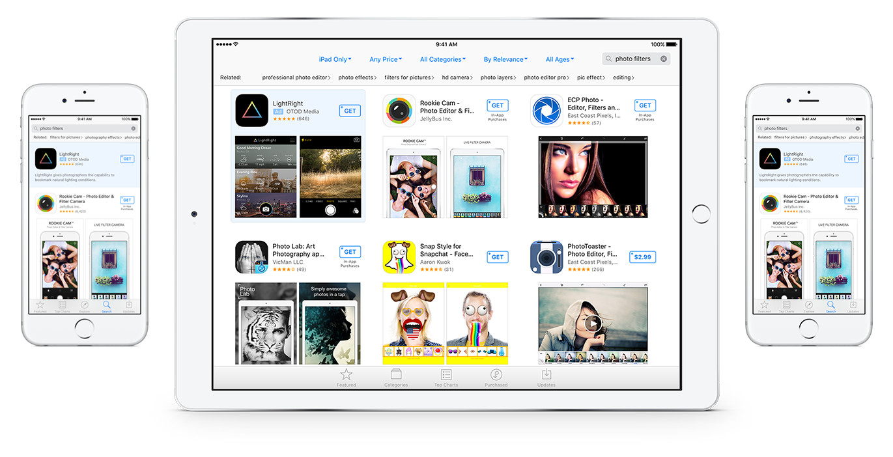

## Overview 概要

**什么是Search Ads？**

搜索广告是一种简单有效的方法，可让您在App Store搜索结果顶部推广您的应用。只有在用户点击您的广告时，您才需要付费，而且我们的竞价系统确保您始终支付公平的市场价格。

搜索广告非常的灵活。比如：

* 无论多少预算都可以推广
* 随时启动或停止
* 没有最低支出
* 无需长期承诺

**谁能使用Search Ads？**

如果您是目前在美国区商店有上架iPhone或iPad版APP的开发者，或是为开发者负责推广的代理商，您都有资格使用搜索广告。某些例外情况适用，所有广告客户必须始终遵守[搜索广告内容和广告政策](http://searchads.apple.com/policies)。

查看哪些[国家/地区列表](http://searchads.apple.com/help/pdf/Search_Ads_Country_List.pdf)的广告客户可以注册搜索广告。

---

## Why advertise 为何做广告

**有什么好处**

搜索广告可以让开发者控制App在App Store中的曝光，从而增加提高下载量的机会。App Store是人们主动去搜索应用程序的主要地方，超过65％注1的应用程序下载来自App Store搜索。搜索广告可帮助您：

*	在用户正在搜索您的应用的时候，宣传您的应用。
*	将您的应用放置在App Store搜索结果的顶部。

通过简单的设置过程和广告系列的灵活性，搜索广告可以适用于所有开发人员，具有任何级别的营销专业知识或任何规模的预算。

注1：基于美国App Store数据

---

## Pricing 价格问题

**怎么定价？**

搜索广告定价是一种CPT模型（每次点击花费），因此您只需在用户点击您的广告时付费。点击的实际成本是第二价格竞价的结果，根据您最接近的竞争对手愿意为其广告点击支付的费用，最高到您的最高CPT出价，计算您支付的CPT。这意味着您可以投标竞争，而不用担心过度支付。

---

## Ad details 广告细节

**广告怎么制作**

搜索广告使用您在App Store商品详情中提供的元数据和图片来制作广告。如果您更改了App Store元数据，最多可能需要17小时才会反映在搜索广告系列应用中的广告预览中，最多可能需要两小时才能反映在您的搜索广告列表中。

**Tip:**
由于广告显示依赖于元数据，因此在开始广告系列之前，请花时间查看iTunes   Connect中的应用程序元数据。搜索广告不支持自定义广告素材，因此您无法更改广告外观或上传自己的广告设计。

[了解App Store元数据最佳实践](https://developer.apple.com/app-store/search/)

**广告看起来如何？**

所有广告都有蓝色背景和广告披露图示。 它可以以几种格式之一显示，具体取决于用户的设备以及对搜索查询和用户最有效的方式。 要查看您设置广告系列时广告的外观示例，请点击广告预览框中的 View Examples (查看示例)。

**广告怎么出现？**

您的广告是否能赢得其他广告客户，取决于您的应用与搜索词的相关性和出价金额的组合。

当你的广告未出现时你更需要注意。例如，如果您的应用与用户寻找的内容不相关，那么不管您愿意支付多少费用，它都不会进入广告位。搜索广告既考虑相关性也考虑出价，并且如果应用不是很好的匹配，则不会将其应用于竞价。

---

## Search Match

Search Match（搜索匹配）是一项默认功能，可让您轻松地在几分钟内开始投放广告。你无需花费时间把所有可能的关键词都找出来，搜索匹配使用多种资源来自动将您的广告与App Store中的相关搜索进行匹配，包括您的App Store商品信息中的元数据，同个分类下的类似应用的信息以及其他相关信息。

---

## Creating campaigns 创建广告系列

您可以根据需要创建任意数量的广告系列。广告系列包含广告组和关键词，您可以根据广告系列的目标进行选择。广告系列、广告组和关键词可以暂停和重新启用，但不能删除，因此请务必在开始之前准备好。

**准备**

*	准备好您的Apple ID。
*	有一个在线的应用程序。
*	知道你能花多少钱。
*	注册搜索广告帐户。
*	添加有效的信用卡。

更多细节，[请看Campaign设置教程](http://searchads.apple.com/video/campaign-setup-tutorial/)。

**Tip:**
如果您要对下载现有APP的用户进行交叉推广或将其添加为受众群体客户类型，请确保在注册搜索广告时使用与您的iTunes Connect帐户相关联的Apple ID。

**广告组（ad groups）**

广告组是与您的应用相关的关键字和目标受众属性的集合。您可以为每个广告组设置特定的目标受众和出价金额。

**Tip:**
为了使每个广告组尽可能高效和有效，请考虑用户是如何搜索的。每个广告组都应关注与您的应用相关的常见主题或策略，以期预测用户可能会如何搜索。

关键字是指用户在搜索您的应用时可能使用的相关字词或短语。当App Store用户输入包含您的某个关键字的搜索查询(search query)时，您的广告可能会展示。

**怎么选择关键词**

搜索广告非常了解您的应用及其类型，并且可以提供关键字建议列表以节省您的时间。您还可以添加自己的关键字，然后搜索广告继续提供一组与之相关的关键字。你可以选择使用或不使用它们。随你便。您还可以使用广告系列管理工具的关键字标签中的电子表格批量上传关键字。在[此处下载](http://searchads.apple.com/help/bulk-keywords-template/keywords_template.csv)关键字模板。

如果您想选择自己的关键字，以下是几个建议：

**像你的客户一样思考**
想想用户会用什么词来搜您的APP。哪些词能说清楚你的APP满足的需求或是提供的服务？

例如，如果您的应用程序是一个新的相机应用程序，其中包含一些独一无二的滤镜功能，则您需要从基本信息开始，例如应用程序的名称。然后，想想你的应用程序可以做什么。像“颜色编辑器”，“图片编辑器”和“照片编辑器”等字词可能会在带来成功的下载。

**一般和特定关键字都尝试**
一般关键字也需要与您的应用提供的内容相关。否则，您的广告不太可能进入这些搜索的竞价。使用一般关键字可以帮助您覆盖更广泛的受众群体，但他们可能竞争更激烈，需要更高的出价金额。

当您选择特定的关键字时，您的广告可能会对与您的APP更相关的搜索查询显示。特定的搜索字词可以帮助您提高广告点击到转化的比例。但如果关键字太具体，可能无法达到您想要的客户数量。

下面分别举例，还是使用提供独特滤镜的相机应用程序作为示例：

**一般关键字**
请考虑使用「相机」来提高您的应用在相关搜索中的可能性。

**特定关键字**
像“照片编辑”这样的关键字说明了您的应用的功能，并可以帮助您缩小受众群体范围。

**使用匹配类型**

匹配类型是搜索广告关键字设置，可帮助您控制关键字与用户搜索的匹配情况。您可以设置两种类型：

**广泛匹配**
这是搜索广告中的默认匹配类型。广泛匹配可确保您的广告投放在关键字的相关近似变体，例如单数、复数、拼写错误、同义词、相关搜索和包含该字词的词组（完全或部分）。

**完全匹配**
为了最大限度地控制可能展示您的广告的搜索，请使用完全匹配。您可以定位特定字词及其近似变体，例如常见拼写错误和复数形式。您的广告的展示次数可能会减少，但您的点击率（TTR）和转化次数可能会更高，因为您会吸引到对您的应用最感兴趣的客户。

您可以随时暂停一种匹配类型并添加另一种，但添加后无法修改。

**Tip: 使用两种类型**
我们建议您投放包含广泛匹配和完全匹配的广告系列，以确保良好的覆盖面和效果。广泛匹配涵盖更广泛的相关搜索字词，从而增加了该关键字的覆盖率。广泛匹配用于发现新词，以及少量的词得到大量的覆盖。完全匹配可让您针对确切的搜索字词展示广告。虽然它为您提供的覆盖率较低，但用户意图的定义更加清晰，您可以对关键字进行合适的定价，以最大限度地提高曝光。[详细了解](campaign-management.html#keywords)关键字和匹配类型。

**如何设置Max CPT Bid？**

您的最高每次点击竞价（CPT）是您愿意为广告点击支付的最高金额。

除非您在关键字一级指定最高出价，否则您的默认最高每次转化费用出价将应用于所有关键字。

如何计算Max CPT：

**决定**
您能为一个新客户或Action支付多少费用？假如是$2.50

**估计**
点击您广告的用户中有百分之几将下载您的APP或采取您期望的操作。例如估计40％。

**计算**
您最多可以为一个点击支付$2.50的40%（也就是$1.00）。所以，将您的Default Max CPT Bid设置为$1.00。

请注意，这是您为广告点击所支付的最高金额。您需要支付的实际金额是根据您最接近的竞争对手愿意为其广告点击支付的金额计算。

**目标CPA**

目标CPA是选填的。我们使用您的目标CPA作为指导，以帮助您最大限度地提高转化次数。（注意：不能保证。）

**Tips:**
我们建议您的广告系列先投放一段时间，以便在设置目标CPA之前了解结果。在设置CPA时，请务必做到实际。如果您将目标CPA设置得过低或过于接近MAX CPT，则可能会错失有价值的展示和转化。

**设置时区**

注册搜索广告账户的时候可以选择时区。选择的时区影响到你所有广告组和报表的开始和结束时间。

重要提示：一旦设置时区无法更改。另外，账单日期是基于UTC时间，和选择的时区无关。

---

## Campaign issues 广告系列疑问

**创建广告系列时，找不到您的APP**

如果您尝试创建广告系列，但您的应用在输入或搜索时未出现，则可能是因为：

**您的APP刚刚发布**
新发布的APP最多可能需要17小时才会出现在App Store中。

**您的APP无法在搜索广告中推广**
您的应用可能违反了一个或多个搜索广告广告[内容政策](http://searchads.apple.com/policies)。也可能不符合[App Store指南](https://developer.apple.com/app-store/review/guidelines/)。请查看政策，如果您有任何其他问题，请[联系我们](maito:SearchAds_Help@apple.com)。

**您的应用名称包含特殊字元**
如果您的应用包含重音字母或其他独特字符，请务必一律纳入，以确保应用名称显示在「广告活动制作」流程中。要键入字符的替代版本，请按住键直到显示其替代字符。然后单击要使用的那个，或键入下面显示的数字。

**我被告知我的搜索广告系列因违反政策而暂停**

您的应用可能违反了一个或多个[搜索广告广告内容政策](http://searchads.apple.com/policies)。也可能不符合[App Store指南](https://developer.apple.com/app-store/review/guidelines/)。请查看政策，如果您有任何其他问题，请[联系我们](maito:SearchAds_Help@apple.com)。

**搜索广告中我的应用显示错误的价格**

如果您在App Store上更改了应用的价格，则最多可能需要两个小时才能在搜索广告中体现。

**您想推广APP套装**

搜索广告目前不支持APP套装。

**您无法从浏览器访问搜索广告**

支持搜索广告的操作系统和浏览器

支持的操作系统
Mac OS 10.11x
Windows 7的

支持的浏览器
Safari（版本9.x）
Chrome（版本53.0.x）

搜索广告目前不支持Internet Explorer。 为了获得最佳体验，我们建议您使用最新版本的Safari或Chrome。其他网络浏览器可能无法使用搜索广告。

**您的广告没有看到展示次数**

有许多因素会影响您的广告是否获得了展示，包括与竞争对手相比的相关性和出价金额，以及App Store上的用户搜索您的应用的次数。无法保证展示次数，但为了提高机会，请尝试启用搜索匹配，调整关键字或提高最高每次点击费用出价。

