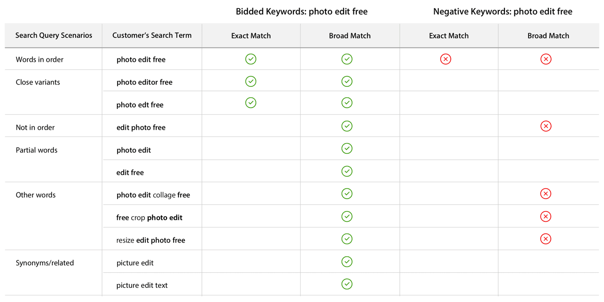

## Keywords 关键词

**如何选择关键词**

搜索广告非常了解您的应用及其类型，并提供关键词建议列表，以节省您的时间。您还可以添加自己的关键词。如果是这种情况，搜索广告会给您另外一组与您提供的关键词相关的建议关键词。您可以选择使用或不使用它们。由您决定。您也可以使用在广告系列管理工具的关键词标签中的这些电子表格批量上传关键词：

添加关键词[Add keywords](http://searchads.apple.com/help/bulk-keywords-template/keywords_template.csv)

添加否定关键词[Add negative keywords](http://searchads.apple.com/help/negative-keywords-template/negative_keywords_template.csv)

下载并打开电子表格后，请在每个列中填入以下信息：

* **Action：**果要添加新关键词，请在此处输入“CREATE”。如果您要更新现有的关键词，请输入“UPDATE”。
* **Keyword ID：**如果您要添加新关键词，请将其留空。如果您要更新关键词，请提供Keyword ID，Keyword ID可在广告组视图的关键词ID列中找到。 （如果不显示，请使用“编辑列”将其移动到“要显示的列”一侧。）
* **Keyword：**输入要添加或编辑的关键词。
* **Match Type：**指定BROAD或EXACT匹配。
* **Status：**指定您希望关键词是ACTIVE还是PAUSED。
* **Bid：**输入您的最高每次点击费用（CPT）出价金额。
* **Campaign ID：**可以在广告系列视图右上角，“修改广告系列设置”的上面找到。
* **Ad Group ID：**可以在广告组视图右上角，“修改广告组设置”的上面中找到。

如果您想选择自己的关键词，以下是几个提示：

1. **像您的客户一样思考**

    考虑某人要查找您的类型的应用可能使用的搜索词。什么词可以解释您的应用程序能满足的需求或它能提供的服务？

    例如，您的应用是一个新的相机应用，其中包含一些在其他应用没有的独特的过滤器。您需要从基本信息开始，例如您的应用名称。但是，然后，想想您的应用程序可以做什么。像“颜色编辑器”，“图片编辑器”和“照片编辑器”等字词也可能会推动下载量。

2. **尝试一般和特定关键词**

    一般关键词也应该与您的应用提供的内容相关。否则，您的广告不太可能进入这些搜索的竞价。使用一般关键词可以帮助您覆盖更广泛的受众群体，但也可能会使您更快地花完预算，因为它们可能竞争更激烈，并且需要更高的出价金额。

    当您选择特定的关键词时，您的广告可能会在与您的应用更相关的搜索查询中显示。特定的搜索词可以帮助您提高广告点击到转化的转化率，但如果关键词过于特殊，您可能无法触达尽可能多的客户。

**如何使用否定关键词**

否定关键词可确保您的广告不会针对特定字词展示。他们可以帮助控制您的成本并提高广告系列的效率。添加否定关键词的默认和推荐设置是完全匹配。

您可以在创建广告系列和广告组时添加否定关键词，也可以在“关键词”标签中使用电子表格进行上传。广告系列开始投放后，您可能会发现需要添加到否定关键词列表中，或缩减。随时可以在“广告系列管理”应用程序的“关键词”标签中进行更改。

否定关键词应与您的出价关键词密切相关，但它们还应指出搜索者正在搜索您应用不提供的内容。

例如，以下情况下，否定关键词是适当的：

1. 您希望对不适用于您的搜索查询不要展示您的广告。因此，如果您的应用关于女性健身，将“男性健身”添加为否定关键词，则表示您的广告不会对与“男性健身”相关的任何搜索进行展示。

2. 您的广告系列或广告组效果数据显示某个关键词不会为您的应用带来转化。

**如何使用否定关键词匹配类型**

**完全匹配（否定关键词）**

作为搜索广告中否定关键词的默认设置，此匹配类型可确保您的广告不会展示给某个确切的字词或词组。它不会阻止您的广告展示给相似变体，如常见的拼写错误和复数形式。我们建议您使用完全匹配，以避免将广告不经意地排除掉了相关搜索。

**例如：**

假设您有高级拼图应用程式，而且您使用的是「拼图」这个关键词，建议您添加否定关键词「儿童拼图」，​​让广告不会展示给该特定搜索词，这样不会在您的应用不打算服务的目标受众群体上花钱。

**广泛匹配（否定关键词）**

要确保您的广告不会针对您选择的字词或词组展示，请使用广泛匹配。广泛匹配否定关键词中的所有关键词都必须同时存在，才可以阻止您的广告。如果使用同义词或近似变体，您的广告仍会显示。

**例如：**

如果您使用高级拼图应用并使用“儿童拼图游戏”作为广泛匹配否定关键词，您的广告就不会显示在“儿童拼图游戏”或“拼图游戏儿童”上，但仍会显示在以下搜索查询中，例如“儿童拼图应用 。如果您还想阻止“儿童益智应用”，请添加“儿童拼图”作为广泛匹配否定关键词。

以下是“photo edit free”这个词基于不同匹配类型得到的结果示例。

---

## Adjusting bids 调整出价

**何时提高出价**

以下是几种情况，您可能想在搜索广告中提高CPT出价：

1. **当Search Match给您的广告匹配到的相关字词增加了下载量时。**
  测试提高您的最高CPT出价，看看它是否会为您带来更多展示次数。

2. **如果您有一个竞价关键词的转化价格低于您的目标CPA时。**
  提高该关键词的出价，在低于目标CPA的前提下获得更多的展示和转化。

3. **您没有看到热门关键词的大量展示。**
  假设您的App与该关键词相关，可能是因为其他对该词有兴趣的广告客户出价高过您了。提高您对特定关键词的出价，看看能否获得更多展示和转化。

**何时降低出价**

在以下情况下，您可以考虑降低CPT出价：

如果您的关键词带来了点击次数，但转化次数偏低而CPA高于您的目标。

降低出价以降低CPA。您仍然可以赢得一些展示，但可能会减少该字词的展示次数。

注意：调整特定关键词的最高CPT出价将会覆盖广告组中的默认最高CPT出价。广告组的默认最高CPT出价仍将应用于添加到该广告组的新关键词。

---

## Managing budgets 管理预算

**如何控制预算**

搜索广告中的广告系列预算没有时间限制。设置预算后，您可以持续消耗，直到用尽或增加预算。如果您希望预算持续特定时长，您可以添加每日支出上限，将消耗分配在所需的时间段内。

例如：如果您的预算是$1200，并且您希望持续30天，则可以考虑将每日支出上限设为每日$40。

一旦达到每日预算上限后，您的广告在当天就会停止显示，但会在第二天重新开始，直到广告系列一级的预算用尽为止。

如果您发现每天消耗都达到每日支出上限，而且投资回报率也达到目标，请考虑提高每日上限，看看是否获得额外的展示次数和转换次数。

注意：有时您可能被收取略高于每日支出上限的费用。不过，我们绝不会向您收取超过整体广告系列预算的费用。

---

## Ad Groups 广告组

**管理广告组**

广告组是与您在进行App Store搜索结果推广中与应用相关的一组关键词。您可以为每个广告组设置特定条件和出价金额。广告组是定义哪些人看到您的广告的有效方式。

例如，您可以将一个广告组定位于与您的应用相关的常见主题。您可以将该广告组设置为高于另外一组较不常见主题关键词的广告组。以这种方式区分广告组还可以单独跟踪和管理您的支出。

像这样：

假设您有一个相机应用，有一些独特的滤镜是其他应用都没有的。您注意到80％的用户是在从iPhone搜索到它的。您可以考虑制作专门针对iPhone的广告组，以便进一步优化出价，从iPhone用户获得更多展示次数。

或者，如果您知道特定性别或年龄的用户对您更有价值，例如18-34岁的男性，您可以创建单独的广告组，以便针对这些受众群体密切管理您的展示机会和出价。

**更改广告系列**

**何时暂停关键词**

您可以随时暂停广告系列中的关键词。 您可能考虑以下时机：

1. 当一个关键词的转换率低时。
  特别是如果它的CPA高于您的目标CPA时。
2. 如果一个广泛匹配关键词的CPA高于您的预期。
  您可以将广泛匹配的关键词暂停，将其作为完全匹配关键词添加。 这样，您就可以维持该特定字词的展示，但不对同义词和相关变体展示。
3. 如果您要使用不同的广泛匹配关键词，或想切换为完全匹配关键词。
  在广告系列中一旦匹配类型设置后，您就无法进行更改。但是，您可以暂停它，并启动另一个。

**何时添加关键词**

当一个关键词效果良好时，请使用关键词建议工具获取更多类似关键词的建议，然后将其添加到您的广告组中。

**调整目标CPA**

目标CPA（每次转化费用）是可选的，但有一个很好的理由选择：我们使用您的目标CPA作为指导，以最大限度地提高您的应用下载量。 （注意：不能保证。）

您可以随时添加或调整目标CPA。 例如，如果您的展示次数偏低，则可以考虑提高目标CPA。 如果价格太低，则可能会阻止您的广告进入竞价。

---

## Account view 账号视图

要访问您的账号视图，请登录到搜索广告，然后点击每个页面右上角的您的姓名。

在您的账号视图中，您可以：

* 创建一个新账号
* 查看您现有账号的列表
* 修改账号设置，包括您的账号信息，其他用户和付款信息（如果您是账号管理员）。

---

## Campaign view 广告系列视图

在广告系列视图中，您可以查看广告系列列表，修改广告系列预算，暂停或启动广告系列，以及创建新的广告系列。

**如何访问“广告系列”视图**

广告系列视图是您在登录时看到的第一个网页。或者，您可以通过点击页面右上角的帐户视图下拉菜单中的帐号名称来访问您的广告系列列表。

**自定义您的广告系列列表视图**

您的广告系列，其状态，ID，应用名称和一系列指标均可在广告系列视图中看到。您可以点击表格右上角的蓝色“修改列”链接，自定义效果指标视图。通过拖放功能，您可以在“要显示的列”部分和“隐藏列”部分之间来回移动项目。

**您可以在“广告系列”视图中执行的操作**

在广告系列视图中，您可以修改广告系列的预算和每日支出上限。但是，广告系列开始后，预算不能降低。

预算没有时间限制，因此请考虑增加每日支出上限，以控制一段时间内预算的花费。

您可以直接在表格栏中修改预算和每日上限：

1. 在广告系列列表表格中，点击要修改的广告系列的预算或每日上限。
2. 突出显示金额。
3. 输入新的预算或每日上限金额并按回车键。

注意：您也可以在点击广告系列后修改预算和每日上限。点击页面右侧的“修改广告系列设置”。

**暂停或启用广告系列**

广告系列创建后无法删除。不过，您可以根据需要暂停和启动广告系列：

1. 从广告系列视图页开始。
2. 选择要激活或暂停的广告系列。
3. 找到操作下拉菜单（创建广告系列按钮旁边），然后选择启动或暂停。

**更改效果视图的日期范围**

页面右侧的下拉菜单提供了包括今天，昨天，最近7天，最近30天，上周，最近4周或最近12周的日期范围。

**创建新的广告系列**

点击创建广告系列按钮开始新的广告系列。系统会显示新页面，您可以选择要推广的应用。

注意：如果您的应用名称包含特殊字符，它可能不会显示为可选项。要键入一个字符的替代版本，请按住键直到其替代字符显示。然后单击要使用的那个，或键入下面显示的数字。

---

## Ad group view 广告组视图

在广告组视图中，您可以管理广告系列设置，查看广告组列表，调整预算，和查看报告。

**如何到达广告组页面**

要在任何广告系列中查看广告组列表，只需点击广告系列视图中的广告系列名称即可。

**自定义您的广告组列表视图**

您的广告组，其状态，ID和效果指标都可以在此视图中看到。顶部的标签提供了其他指标。如果您希望自定义效果指标视图，请使用“修改列”链接。

**修改广告系列预算和每日上限**

点击广告组页面右上角的“修改广告系列设置”。新页面打开，您可以调整预算和每日上限。但是，一旦广告系列开始投放后，您无法降低预算。您在此处所做的任何更改都将应用于广告系列中的所有广告组。

注意：您也可以在广告系列视图中修改广告系列的预算和每日上限。

**更改广告组的默认CPT出价**

在广告组视图中，您可以更改每个广告组的默认CPT出价。只需点击列中的数字即可将其突出显示，并输入新的金额。

**暂停或启动广告组**

1. 从广告组页面开始。
2. 选择您要启动或暂停的广告组。
3. 找到操作下拉菜单（创建广告组按钮旁边）。
4. 单击启动或暂停。

**创建新的广告组**

要创建新的广告组，只需点击创建广告组按钮即可。系统会显示一个新页面，您可以在其中自定义广告组。输入以下信息：

* Ad group name 广告组名称
* Devices 设备
* Default CPT Bid 默认CPT出价
* Ad scheduling preferences 广告投放时间设置（可选）
* CPA goal 目标CPA（可选）
* Search Match 搜索匹配 Y/N
* Keywords 关键词（可选）
* Negative Keywords 否定关键词（可选）
* Audience selection details 受众群体选择详情（可选）

进行选择，然后单击保存。

**查看所有关键词**

您可以点击“所有关键词”，查看所有广告组中的所有竞价关键词及其效果指标。

注意：此数据视图不包括通过搜索匹配与您的广告匹配的搜索词。要全面了解搜索词的效果，包括搜索匹配，请选择搜索词标签。

**搜索词标签**

通过“搜索词”标签，您可以深入了解所有竞价关键词和搜索匹配效果指标。这些指标是整个广告系列中所有广告组的汇总数据。在这里您可以执行以下操作：

* 查看关键指标和效果，例如带来展示、点击和转化的搜索词。
* 发现搜索匹配已自动与您的广告匹配的搜索查询，并查看其效果。
* 确定成功的搜索匹配和广泛匹配的搜索词，并添加为出价关键词。
* 了解哪些搜索匹配或广泛匹配词无效，并考虑将其添加到否定关键词列表中

了解哪些搜索词带来下载并且CPA效率高，哪些搜索词的效果不佳，您可以相应地优化广告系列。

例如，如果您发现一个搜索匹配的词效果良好，并且希望获得更多展示次数，可以考虑将该词添加为完全匹配或广泛匹配关键词。这样，您可以提高出价以获得额外的展示次数，而不会影响整个广告组的默认CPT出价。或者，如果您看到的一个广泛匹配词无法为您带来转化，请考虑将其添加为完全匹配否定词，以便您的广告不会针对该查询展示。

**修改否定关键词**

在否定关键词标签中，您可以向广告系列或特定广告组添加更多否定关键词，或者删除否定关键词。

---

## Ad group keywords view 广告组关键词视图

要进入广告组关键词视图，只需点击列表中广告组的名称即可。在这里，您可以管理关键词，查看报表和修改广告组设置。

**查看关键词**

在“广告组关键词”标签上，您可以查看所选广告组中所有关键词的列表及其效果。

注意：此视图不包括搜索匹配词。要全面查看所有搜索查询效果，请选择搜索词标签。

**更改效果视图的日期范围**

页面右侧的下拉菜单提供了包括今天，昨天，最近7天，最近30天，上周，最近4周或最近12周的日期范围。

**向广告组添加关键词**

点击要修改的广告组，然后点击添加关键词。将打开一个对话框，您可以：

* 要添加推荐的关键词，点击词旁边的“+”。
* 要添加所有推荐的关键词，点击列表底部的“添加到关键词”，。
* 要搜索更多关键词，在搜索字段中输入搜索词并按回车键查看相关字词，。
* 点击“+”或“添加到关键词”。
* 要添加您自己的关键词，在“我的关键词列表”框中输入。请务必以逗号分隔，然后按回车。

注意：如果您的关键词包含特殊字符，它可能不会显示为可选项。要键入一个字符的替代版本，请按住键直到其替代字符显示。然后单击要使用的那个，或键入下面显示的数字。

在“我的关键词列表”框中添加更多关键词后，您可以使用右侧的“编辑”按钮进行修改。 “编辑”按钮可让您：

* 选择要更改的关键词。
* 将匹配类型从广泛匹配更改为完全匹配，反之亦然。注意：保存关键词后，将无法更改其匹配类型。
* 更新所选关键词的出价。

**修改关键词的每次点击费用（CPT）出价**

查找“CPT出价”列。突出显示您要调整的出价，输入新金额，然后按回车键。

**修改广告组中的关键词**

在广告组投放期间，您可以使用批量下载和上传功能修改广告组的关键词。为此，只需完成以下步骤：

1. 点击操作，然后从弹出菜单中选择下载关键词。
2. 打开下载到您计算机的广告组关键词的.csv文件。
3. 对.csv文件进行更改。
4. 在.csv文件开头插入列，并将列标题标记为“操作”。对于.csv文件中的每一行，指示您的编辑是“UPDATE”更新现有关键词还是“CREATE”以添加新关键词。
5. 再次点击操作，然后从弹出菜单中选择上传关键词。
6. 浏览修订的.csv文件，然后选择它。
7. 点击上传。

**搜索词标签**

通过广告组视图中的搜索词标签，您可以深入了解所选广告组的所有竞价关键词和搜索匹配效果指标。在这里您可以执行以下操作：

* 查看关键指标和效果，例如带来展示，点击和转化的搜索词。
* 发现由搜索匹配自动与您的广告匹配的搜索查询，并查看其效果。
* 确定成功的搜索匹配和广泛匹配搜索词以添加为出价关键词。
* 了解哪些搜索匹配或广泛匹配词无效，并且应添加到否定关键词列表中

一旦您了解了哪些搜索词以有效CPA促成了下载，哪些搜索词无效，您可以相应地优化广告组。

例如，如果您发现一个搜索匹配词带来了良好的效果，并且您希望获得更多展示，请考虑将该字词添加为完全匹配或广泛匹配关键词。这样，您可以获得更多出价以获得额外展示次数，而不会影响整个广告组的默认最高CPT出价。或者，如果您看到一个广泛匹配词没有产生展示，请考虑将其添加为完全匹配否定词，这样您的广告就不会再对该查询展示。

**修改否定关键词**

在否定关键词标签中，您可以为所选广告组添加更多否定关键词，以及删除否定关键词。

---

## Campaign Management API 广告系列管理API

**谁可以使用API**

搜索广告的广告系列管理API适用于希望以编程方式管理广告系列并提取报表的开发者，代理机构和第三方平台。

借助API，您可以构建软件来管理广告系列，广告组和关键词。它允许广告主或第三方更有效地管理其较大的搜索广告帐户和广告系列，或通过自己的产品提供搜索广告之外的附加功能。以下是一些用例：

* 自定义报告
* 摄取数据到内部商业智能系统
* 跨渠道广告系列管理
* 自动出价管理

[查看完整的API文档](https://developer.apple.com/library/content/documentation/General/Conceptual/AppStoreSearchAdsAPIReference/)

**入门**

要有效地实施搜索广告API，您需要了解技术要求并提前规划，以确保您拥有开发和维护应用所需的资源。

API：

* 提供 [REST](http://www.xfront.com/REST-Web-Services.html) 访问广告系列管理。
* 以 [JSON](http://www.json.org/) 格式返回数据。
* 受所有流行的编程语言支持。
