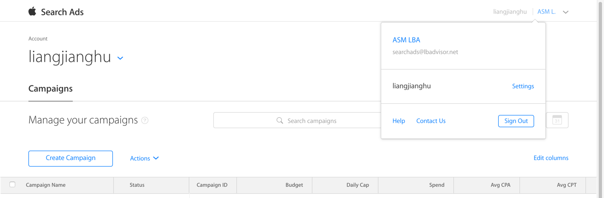
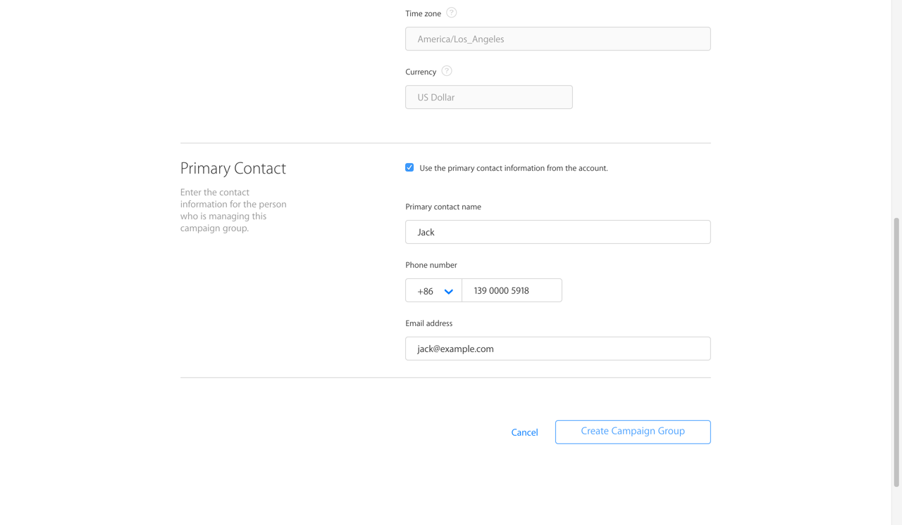
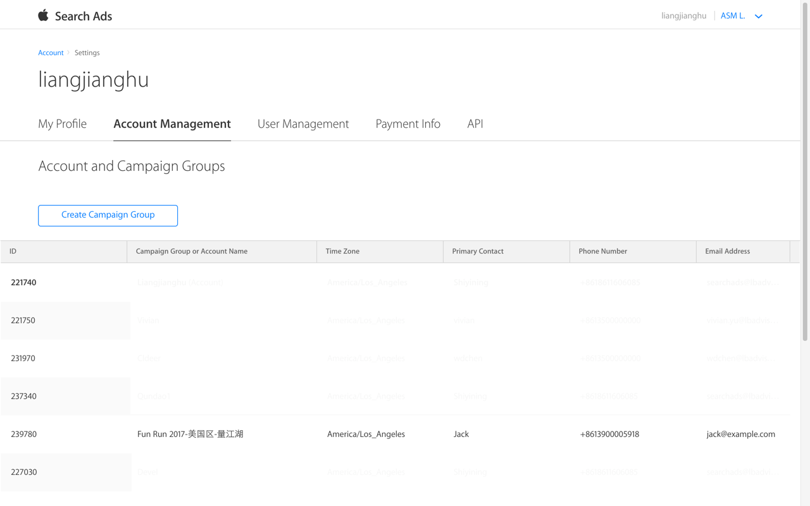

## 创建广告系列组

1. 登录[苹果搜索广告控制台](https://app.searchads.apple.com/cm/app/)

	点击页面右上角，然后点“Settings”

	

2. 选择“Account Management”，点击“Create Campaign Group”

	

3. 填写Campaign Group信息

	
	
	

	创建完成：

	

## 创建API证书

1. 点击“API”，然后点“Create API Certificate”

	

2. 填写Certificate名称，选择Campaign Group以及角色

	** 广告投放的角色必需选择Campaign Group或Admin

	

3. 勾选创建好的证书，点击“Action”-“Download certificate”

	

4. 到下载目录中，查看下载的zip文件

	
